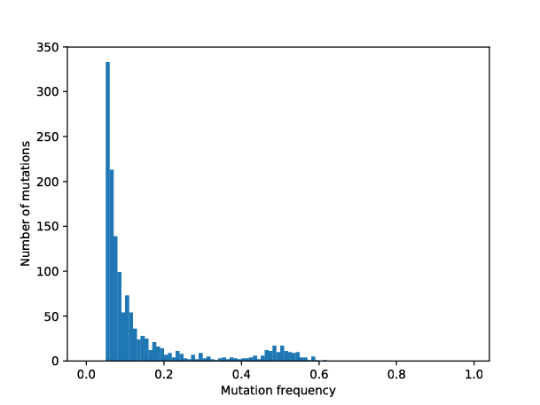

Background
----------

Cancer is a group of complex diseases characterized by excessive cell
proliferation, invasion, and destruction of the surrounding tissue
 \[[1](#ref-kumar:book:2017)\]. Its high division and mutation rates lead to excessive
intratumour genetic heterogeneity which makes cancer highly adaptable to
environmental pressures such as therapy  \[[2](#ref-turajlic:NRG:2019)\]. Throughout most
of its existence tumour is inaccessible to direct observation and
experimental evaluation. Therefore, computational modelling can be
useful to study many aspects of cancer. Some examples where theoretical
models can be of great use include early carcinogenesis, as lesions are
clinically observable when they already contain millions of cells,
seeding of metastases, and cancer cell dormancy \[[3](#ref-altrock:NatRevCancer:2015)\].

Here, we present CancerSim, a software that simulates somatic evolution
of tumours. The software produces virtual spatial tumours with variable
extent of intratumour genetic heterogeneity and realistic mutational
profiles. Simulated tumours can be subjected to multi-region sampling to
obtain mutation profiles that are realistic representation of the
sequencing data. This makes the software useful for studying various
sampling strategies in clinical cancer diagnostics. An early version of
this cancer evolution model was used to simulate tumours subjected to
sampling for classification of mutations based on their abundance
\[[4](#ref-opasic:BMCCancer:2019)\]. Target users are scientists working in the field of
mathematical oncology and students with interest in studying somatic
evolution of cancer.

Our model is abstract, not specific to any neoplasm type and does not
consider a variety of biological features commonly found in neoplasm
such as vasculature, immune contexture, availability of nutrients, and
architecture of the tumour surroundings. It resembles the most to
superficially spreading tumours like carcinoma in situ, skin cancers, or
gastric cancers, but it can be used to model any tumour on this abstract
level.

The tumour is simulated using a two-dimensional, on-lattice, agent-based
model. The tumour lattice structure is established by a sparse matrix
whose non-zero elements correspond to the individual cells. Each cell is
surrounded by eight neighbouring cells (Moore neighbourhood). The value
of the matrix element is an index pointing to the last mutation cell
acquired in the list of mutations which is updated in each simulation
step.

The simulation advances in discrete time-steps. In each simulation step,
every tumour cell in the tumour that has an unoccupied neighbour can
divide with a certain probability (params.div\_\_probability). The
daughter cell resulting from a cell division inherits all mutations from
the parent cell and acquires a new mutation with a given probability
(params.mut\_prob). Different division probabilities can be introduced
for some cells in order to simulate variability in fitness of cells that
acquired a beneficial or deleterious mutation. The simulation allows the
acquisition of more than one mutational event per cell
(params.mut\_per\_division). In that case, variable amounts of
sequencing noise \[[5](#ref-williams:NG:2016)\] can be added to make the output data
more biologically realistic.

Throughout the cancer growth phase, CancerSim stores information about
the parent cell and a designation of newly acquired mutations for every
cell. Complete mutational profiles of cells are reconstructed a
posteriori based on the stored lineage information.

The division rules which allow only cells with empty neighbouring nodes
to divide, cause exclusively peripheral growth and complete absence of
dynamics in the tumour centre. To allow for variable degree of growth
inside the tumour, we introduced a death process. At every time step,
after all cells attempt their division, a number of random cells die and
yield their position to host a new cancer cell in a subsequent time
step.

After the simulation, the tumour matrix, and the lists of lineages and
frequencies of each mutation in the tumour are exported to files.
Furthermore, the virtual tumour can be sampled and a histogram over the
frequency of mutations will be visualised. Alternatively, a saved tumour
can be loaded from file and then be subjected to the sampling process.

Installation
------------

CancerSim is written in Python (version \>3.5). We recommend to install
it directly from the source code. To download the code:

**EITHER** clone the repository:

    $> git clone https://github.com/mpievolbio-scicomp/cancer_sim.git

**OR** download the source code archive:

    $> wget https://github.com/mpievolbio-scicomp/cancer_sim/archive/master.zip
    $> unzip master.zip
    $> mv cancer_sim-master cancer_sim

Change into the source code directory

    $> cd cancer_sim

We provide for two alternatives to install the software after it was
downloaded:

### Alternative 1: Conda

#### New conda environment

We provide an `environment.yml` to be consumed by `conda`. To create a
fully self-contained conda environment (named `casim`):

    $> conda env create -n casim --file environment.yml

This will also install the cancer simulation code into the new
environment.

To activate the new conda environment:

    $> source activate casim

or

    $> conda activate casim

if you have set up conda appropriately.

#### Install into existing and activated conda environment

To install the software into an already existing environment:

    $> conda activate <name_of_existing_conda_environment>
    $> conda env update --file environment.yml

### Alternative 2: Using pip

The file `requirements.txt` is meant to be consumed by `pip`:

    $> pip install -r requirements.txt [--user]

The option `--user` is needed to install without admin privileges.

Testing
-------

Although not strictly required, we recommend to run the test suite after
installation. Simply execute the `run_tests.sh` shell script:

    $> ./run_tests.sh

This will generate a test log named `casim_test@<timestamp>.log` with
`<timestamp>` being the date and time when the test was run. You should
see an `OK` at the bottom of the log. If instead errors or failures are
reported, something is wrong with the installation or the code itself.
Feel free to open a github issue at
<https://github.com/mpievolbio-scicomp/cancer_sim/issues> and attach the
test log plus any information that may be useful to reproduce the error
(version hash, computer hardware, operating system, python version, a
dump of `conda env export` if applicable, ...).

The test suite is automatically run after each commit to the code base.
Results are published on
[travis-ci.org](https://travis-ci.org/mpievolbio-scicomp/cancer_sim).

High-level functionality
-------------------------

### Setting the simulation parameters
The parameters of the cancer simulation are given via a python module or
programmatically via the `CancerSimulationParameters` class. A
documented example `params.py` is included in the source code (under
`casim/params.py`) and reproduced here:

    $> cat casim/params.py
    # Number of mesh points in each dimension
    matrix_size = 100

    # Number of generations to simulate.
    number_of_generations = 20

    # Number of divisions per generation.
    division_probability = 1

    # Number of division for cells with mutation.
    adv_mutant_division_probability = 1

    # Fraction of cells that die per generation.
    death_probability = 0.1

    # Fraction of cells with mutation that die per generation.
    adv_mutant_death_probability = 0.0

    # Rate of mutations.
    mutation_probability = 1

    # Mutation probability for the adv. cells.
    adv_mutant_mutation_probability = 1

    # Number of mutations per cell division.
    number_of_mutations_per_division = 10

    # Time after which adv. mutations occur.
    adv_mutation_interval = 10

    # Number of mutations present in first cancer cell.
    number_of_initital_mutations = 150

    # Tumour multiplicity.
    tumour_multiplicity = None

    # Sequencing read depth.
    read_depth = 100

    # Fraction of cells to be sampled.
    sampling_fraction = 0.9
        
    # Plot the tumour growth curve.
    plot_tumour_growth = True
        
    # Export the tumour growth data to file.
    export_tumour = True

Here, we simulate a 2D tumour on a 100x100 grid for a total of 20 generations.
On average, both healthy and mutant cells divide once per generation. The first
cancer cell carries 150 mutations.
Mutant cells with advantageous mutations live on forever while healthy cells die with a rate of 0.1 per generation.
Both healthy and mutant cells aquire 10 new mutations in
each generation with a certainty of 100%. Every 10th generation, a mutation is
advantageous (i.e. cancerogenic).

90% of all cells are sampled on a random basis and sequenced with a read depth
of 100. The data is written to disk and a plot showing the tumour growth in
generated.
 
The simulation is started from the command line. The syntax is

    $> python -m casim.casim [-h] [-s SEED] [-p PARAMS] [-o DIR]

`SEED` is the random seed. Using the
same seed in two simulation runs with identical parameters results in
identical results. If not given, `SEED` defaults to 1. `PARAMS` should point to
a python parameter file. If not given, it defaults to `params.py` in the current
working directory. If that file does not exist, default parameters are assumed.
`DIR` specifies the directory where to store the
simulation log and output data. If not given, output will be stored in
the directory `casim_out` in the current directory. For each seed, a
subdirectory `cancer_SEED` will be created. If that subdirectory already
exists because an earlier run used the same seed, the run will abort.
This is a safety catch to avoid overwriting data from previous runs.

### Run the example

    $> python -m casim.casim 1 -p casim/params.py -o cancer_sim_example

### Output
After the run has finished, you should find the results in
`cancer_sim_example/cancer_1/simOutput`.

    $> ls cancer_sim_example/cancer_1/simOutput
    death_list.p     mtx.p        mut_container.p              sample_out_502_488.txt
    growthCurve.pdf  mtx_VAF.txt  sampleHistogram_502_488.pdf  wholeTumourVAFHistogram.pdf
   
Files with the extension `.p` are binary files (python pickles) needed to
restart a simulation. Let's take a look at the `.txt`  files. They contain the simulation output:
`mtx_VAF.txt` is a datafile with three columns: `mutation_id` lists the index of
each primary mutation, `additional_mut_id` indexes the subsequent mutations that occur in a cell of
a given `mutation_id`; `frequency` is the frequency which at a given mutation occurs.

The file `sample_out_502_488.txt` lists all mutations of the artificial sample
taken from the whole tumour. Columns are identical to `mtx_VAF.txt`.
 
The two `.pdf` files are plots of the whole tumour histogram and the sampled
tumour histogram, respectively. You should see figures similar to these:

Even though we sample at a rather high sampling rate of 90%, we miss
out on all mutations with a frequency below 0.3.

### Example notebook
Another example demonstrating how to parametrize the simulation through the
`CancerSimulationParameters` API is provided in the accompanying jupyter notebook at
`docs/source/include/notebooks/quickstart_example.ipynb`. Launch it in
[binder](https://mybinder.org/v2/gh/mpievolbio-scicomp/cancer_sim.git/master?filepath=docs%2Fsource%2Finclude%2Fnotebooks%2Fquickstart_example.ipynb).

Community Guidelines
--------------------
As an Open Source project, we welcome all contributions to CancerSim. We
recommend the usual github workflow: Fork this repository, commit
your changes and additions to the fork and create a pull request back to the
master branch on this repository. If uncertain about anything, please create an
issue at [https://github.com/mpievolbio-scicomp/cancer_sim/issues](https://github.com/mpievolbio-scicomp/cancer_sim/issues).

Comments, bug reports, or other issues as well as requests
for support should be submitted as a [github
issue](https://github.com/mpievolbio-scicomp/cancer_sim/issues). Please check
the [list of issues](https://github.com/mpievolbio-scicomp/cancer_sim/issues?q=is%3Aissue) if your problem has already been addressed. We will do our best to respond in a timely manner.

References
----------

 \[1\] J. C. A. Vinay Kumar Abul K. Abbas,
*Robbins Basic Pathology*, 10th ed. (Elsevier, 2017). ISBN: 9780323353175. 

 \[2\] S. Turajlic, A. Sottoriva, T. Graham,
and C. Swanton, Nat Rev Genet (2019). DOI:
[10.1038/s41576-019-0114-6](https://dx.doi.org/10.1038/s41576-019-0114-6)

 \[3\] P. M. Altrock, L. L. Liu, and
F. Michor, Nat Rev Cancer **15**, 730 (2015).
 DOI:
[10.1038/nrc4029](https://dx.doi.org/10.1038/nrc4029)

 \[4\] L. Opasic, D. Zhou, B. Werner, D.
Dingli, and A. Traulsen, BMC Cancer **19**, 403 (2019).
 DOI:
[10.1186/s12885-019-5597-1](https://dx.doi.org/10.1186/s12885-019-5597-1)

 \[5\] M. J. Williams, B. Werner, C. P. Barnes,
T. A. Graham, and A. Sottoriva, Nature Genetics **48**, 238 (2016).  DOI:
[10.1038/ng.3489](https://dx.doi.org/10.1038/ng.3489)
